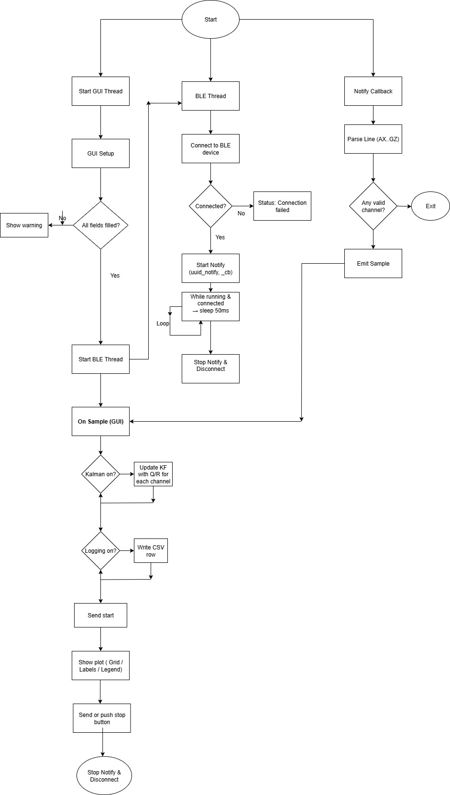
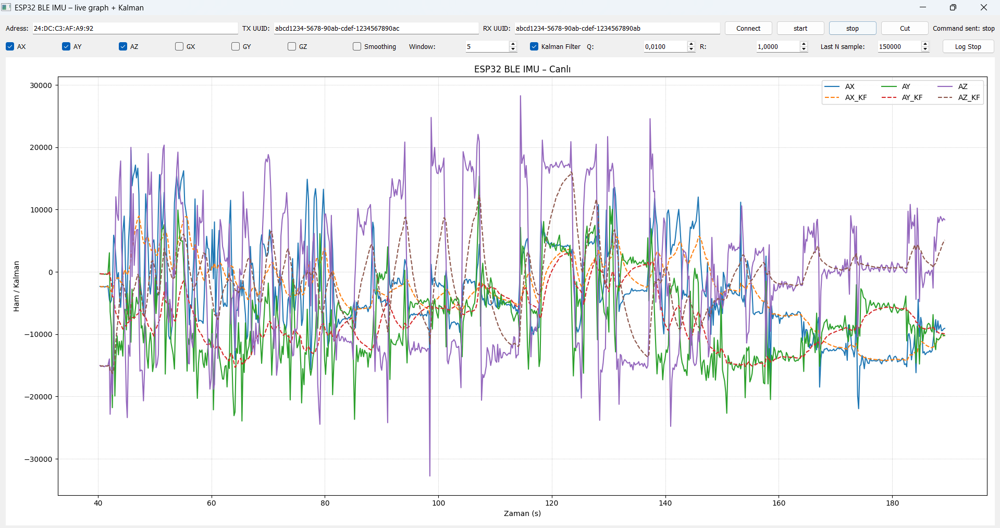

# Esp32-BLE-GUI-entegration
This Python-based desktop interface connects to an ESP32 via Bluetooth Low Energy, receives real-time sensor data, and visualizes it with PyQt5 and Matplotlib. It supports Kalman and moving average filters for noise reduction, CSV logging, and live control of data acquisition.

## Hardware and Software
- MPU6050
- ESP 32S
- Python
- Arduino IDE
- Pyqt5
- USB (for power)
## Data Format
The data is taken from MPU6050 live data.
```cpp
AX:<int> AY:<int> AZ:<int> GX:<int> GY:<int> GZ:<int>
```
# Arduino IDE code
Workflow Summary\
Client connects → sends “start” → ESP32 streams sensor data over BLE → client sends “stop” to end transmission.
## Connection Diagram
A simple diagram showing I2C connections between ESP32 and MPU6050 is below.\
Pin mapping table:
| ESP32 Pin | MPU6050 Pin |
| --------- | ----------- |
|   5V      | VCC         |
|   GND     | GND         |
|    P21    | SDA         |
|    P22    | SCL         |
## Command List
These are the all available commands for the RX characteristic.
| Command | Description                  |
| ------- | ---------------------------- |
| `start` | Starts streaming sensor data |
| `stop`  | Stops streaming sensor data  |
## Setup Instructions
Open Arduino IDE\
Install MPU6050 and ESP32 BLE Arduino libraries\
Modify SERVICE_UUID, CHAR_RX_UUID, and CHAR_TX_UUID if necessary\
Upload the code to ESP32\
Connect via a BLE-capable device and send commands
## Required Libraries
Uses Wire.h for I2C communication, MPU6050.h for sensor control, and several ESP32 BLE libraries (BLEDevice.h, BLEServer.h, BLEUtils.h, BLE2902.h) for wireless data transfer.
```cpp
#include <Wire.h>              // For I2C communication
#include <MPU6050.h>           // For MPU6050 sensor control
#include <BLEDevice.h>         // For BLE device definition
#include <BLEServer.h>         // For BLE server object
#include <BLEUtils.h>          // BLE utility functions
#include <BLE2902.h>           // Descriptor definition for Notify feature
```
## Starting I2C and BLE
**RX Characteristic (Write)**\
Purpose: Receives control commands from the BLE client.\
Data Direction: Client → ESP32.\
**TX Characteristic (Notify)**\
Purpose: Sends live sensor data to the connected BLE client.\
Data Direction: ESP32 → Client.
```cpp
void setup() {
  Serial.begin(115200);         // Start serial monitor
  Wire.begin();                 // Start I2C
  mpu.initialize();             // Initialize MPU6050 
  if (mpu.testConnection()) {
    Serial.println("MPU6050 sensor is ready.");
  } else {
    Serial.println("MPU6050 connection failed!");
  }
  // BLE configuration
  BLEDevice::init("ESP32_MPU6050");                 // Device name 
  BLEServer *pServer = BLEDevice::createServer();   // Create BLE server
  BLEService *pService = pServer->createService(SERVICE_UUID); // Create service
  // RX characteristic: receives commands from the phone
  BLECharacteristic *pRxCharacteristic = pService->createCharacteristic(
    CHAR_RX_UUID,
    BLECharacteristic::PROPERTY_WRITE
  );
  pRxCharacteristic->setCallbacks(new MyCallbacks()); // Handle incoming commands
  // TX characteristic: sends sensor data
  pTxCharacteristic = pService->createCharacteristic(
    CHAR_TX_UUID,
    BLECharacteristic::PROPERTY_NOTIFY
  );
  pTxCharacteristic->addDescriptor(new BLE2902()); // Required for Notify feature
  pService->start();                        // Start the service
  pServer->getAdvertising()->start();       // Start BLE advertising
  Serial.println("BLE started.");
void loop() {
  // If streaming is enabled, read from sensor and send data
  if (startStreaming) {
    int16_t ax, ay, az, gx, gy, gz;

    mpu.getMotion6(&ax, &ay, &az, &gx, &gy, &gz); // Read raw data from MPU6050

    // Format the data into a single string
    String data = "AX:" + String(ax) + " AY:" + String(ay) + " AZ:" + String(az) +
                  " GX:" + String(gx) + " GY:" + String(gy) + " GZ:" + String(gz);

    Serial.println(data); // Output to serial monitor

    pTxCharacteristic->setValue(data.c_str()); // Write data to the characteristic
    pTxCharacteristic->notify();               // Send via BLE Notify

    delay(200); // Send rate: 5Hz (200ms delay)
```
## Arduino IDE Output Example
MPU6050 sensor is ready.
BLE started.
Streaming started.
AX:512 AY:340 AZ:16384 GX:12 GY:-7 GZ:5

# Python Code
The Python script serves as a graphical BLE client for the ESP32 MPU6050 streaming system. Built with PyQt5 for the user interface and Matplotlib for real time data visualization, it connects to the ESP32 via the Bleak BLE library.
## Flowchart of the Code
General flowchart of the code is below.

## Installation and Setup
Make sure you have Python 3.9 or later installed.\
Install all required packages with: 
```cpp
pip install -r requirements.txt
```
BLE works out-of-the-box on Windows 10+ with bleak.\
Ensure your Bluetooth adapter is enabled.\
Run the application
kalmanlıgraphgui.py\
Then connect to your ESP32 device via the Connect button in the GUI. Press reset button in ESP32 everytime creating a new graph run.
## Importing Necessary Libraries
PyQt5 - GUI creation and event handling\
Bleak - BLE device connection & data reading\
Matplotlib - Real-time plotting in the GUI\
Pandas - CSV logging and data processing\
asyncio - Non-blocking BLE operations
```cpp
import sys
import asyncio
import time
from dataclasses import dataclass
from typing import Optional, List, Deque
from collections import deque
from PyQt5.QtCore import Qt, QThread, pyqtSignal, QTimer
from PyQt5.QtWidgets import (
    QApplication, QMainWindow, QWidget, QVBoxLayout, QHBoxLayout,
    QPushButton, QLabel, QLineEdit, QCheckBox, QSpinBox, QDoubleSpinBox,
    QFileDialog, QMessageBox)
from bleak import BleakClient
from matplotlib.backends.backend_qt5agg import FigureCanvasQTAgg as FigureCanvas
from matplotlib.figure import Figure
import pandas as pd
```
## Applying Kalman Filter
The code applies 1D Kalman Filter to MPU6050 data.
```cpp
class Kalman1D:
    def __init__(self, Q=0.01, R=1.0):
        self.Q = Q
        self.R = R
        self.x = 0.0
        self.P = 1.0
        self.initialized = False
    def update(self, measurement):
        if measurement is None or pd.isna(measurement):
            return float('nan')
        if not self.initialized:
            self.x = measurement
            self.initialized = True
        else:
            self.P += self.Q
            K = self.P / (self.P + self.R)
            self.x += K * (measurement - self.x)
            self.P *= (1 - K)
        return self.x
```

## BLE Thread
The python code receives the data package from MPU6050 via BLE. The code directly takes data from obtained MAC Adress. The BLE communication runs in a dedicated QThread separate from the main GUI thread. This design ensures that Bluetooth scanning, connection, and data reception do not block the user interface.
```cpp
@dataclass
class Sample:
    t: float
    ax: Optional[float] = None
    ay: Optional[float] = None
    az: Optional[float] = None
    gx: Optional[float] = None
    gy: Optional[float] = None
    gz: Optional[float] = None

class BLEReader(QThread):
    sample_ready = pyqtSignal(object)
    status = pyqtSignal(str)

    def __init__(self, address: str, uuid_notify: str, uuid_write: str):
        super().__init__()
        self.address = address
        self.uuid_notify = uuid_notify
        self.uuid_write = uuid_write
        self._running = False
        self._t0 = None
        self._client: Optional[BleakClient] = None

    async def _write_cmd(self, cmd: str):
        try:
            if self._client and self._client.is_connected:
                await self._client.write_gatt_char(self.uuid_write, cmd.encode('utf-8'))
                self.status.emit(f"Komut gönderildi: {cmd}")
            else:
                self.status.emit("Yazılamıyor: Bağlı değil.")
        except Exception as e:
            self.status.emit(f"Komut yazılamadı: {e}")

    def send_start(self):
        asyncio.run(self._write_cmd("start"))

    def send_stop(self):
        asyncio.run(self._write_cmd("stop"))

    def stop(self):
        self._running = False

    def run(self):
        try:
            asyncio.run(self._runner())
        except Exception as e:
            self.status.emit(f"BLE thread hata: {e}")

    async def _runner(self):
        self._running = True
        self._t0 = time.perf_counter()
        try:
            async with BleakClient(self.address) as client:
                self._client = client
                if not client.is_connected:
                    self.status.emit("Bağlanılamadı.")
                    return
                self.status.emit("Bağlandı. Notify başlatılıyor…")

                def _cb(_sender, data: bytearray):
                    try:
                        line = data.decode(errors='ignore').strip()
                        if not line:
                            return
                        s = self.parse_line(line)
                        if s:
                            self.sample_ready.emit(s)
                    except Exception:
                        pass

                await client.start_notify(self.uuid_notify, _cb)
                self.status.emit("Notify aktif. Veri bekleniyor…")

                while self._running and client.is_connected:
                    await asyncio.sleep(0.05)

                try:
                    await client.stop_notify(self.uuid_notify)
                except Exception:
                    pass
                self.status.emit("Notify durduruldu.")
        except Exception as e:
            self.status.emit(f"BLE hata: {e}")
        finally:
            self._client = None
```
## GUI Creating Thread
The application’s user interface runs in the main PyQt5 GUI thread./
This layer is responsible for controls and settings, data buffers (deque), and the live plot./
Since BLE communication runs in a separate thread, the GUI remains smooth and responsive at all times.
```cpp
class BLEIMUGui(QMainWindow):  # Main window (controls + plot + status)
    def __init__(self):
        super().__init__()  # QMainWindow constructor
        self.setWindowTitle("ESP32 BLE IMU – Live Graph + Kalman")  # Window title
        self.resize(1250, 720)  # Initial size

        self.reader: Optional[BLEReader] = None  # BLE thread reference (None when not connected)
        self.logging_enabled = False  # Is CSV logging enabled?
        self.log_file = None  # Pointer to the opened log file

        self.canvas = MplCanvas(self)  # Create plotting canvas
        root.addWidget(self.canvas, 1)  # Add canvas with stretch=1 to expand flexibly

        self.timer = QTimer(self); self.timer.setInterval(50)  # Trigger every 50 ms (~20 FPS)
        self.timer.timeout.connect(self.redraw)  # Update plot on each trigger
        self.timer.start()  # Start timer

    def connect_ble(self):  # "Connect" button: start BLE thread
        if self.reader is not None:  # If already connected
            QMessageBox.information(self, "Info", "Already connected."); return  # Inform user and exit
        addr = self.edt_addr.text().strip()  # Get MAC address from UI
        uuid_tx = self.edt_tx.text().strip()  # TX UUID (notify)
        uuid_rx = self.edt_rx.text().strip()  # RX UUID (write)
        if not addr or not uuid_tx or not uuid_rx:  # If fields are empty
            QMessageBox.warning(self, "Warning", "Address, TX, and RX UUID cannot be empty."); return
        self.reader = BLEReader(addr, uuid_tx, uuid_rx)  # Create BLE thread
        self.reader.sample_ready.connect(self.on_sample)  # Send new samples to GUI
        self.reader.status.connect(self.on_status)  # Show status messages in GUI label
        self.reader.start()  # Start thread (run() → _runner())
        self.on_status("Trying to connect…")  # Inform user

    def send_start(self):  # "Start" button
        if self.reader: self.reader.send_start()  # Send "start" command to BLE
        else: self.on_status("Not connected.")  # Inform user if not connected

    def send_stop(self):  # "Stop" button
        if self.reader: self.reader.send_stop()  # Send "stop" command
        else: self.on_status("Not connected.")  # Warn if not connected

    def disconnect_ble(self):  # "Disconnect" button: close connection
        try:
            if self.reader:  # If thread exists
                try: self.reader.send_stop()  # Attempt to send stop command (harmless if fails)
                except Exception: pass  # Ignore errors
                self.reader.stop(); self.reader.wait(1000)  # End thread loop and wait 1 sec
                self.reader = None  # Clear reference
        finally:
            self.on_status("Connection closed.")  # Inform user

    def on_status(self, msg: str):  # Show status messages from BLEReader
        self.lbl_status.setText(msg)  # Display in label

 
```
## Sampling Thread
Extracts sensor values and timestamps them.\
Stores data in ring buffers to maintain a fixed history without excessive memory use.\
Applies optional Kalman filtering to smooth noise on each axis individually.\
Logs samples to CSV if logging mode is enabled.
```cpp
def on_sample(self, sample):
    # sample = (timestamp, AX, AY, AZ, GX, GY, GZ)

    t, ax, ay, az, gx, gy, gz = sample

    # Append raw values to ring buffers
    self.t_buf.append(t)
    self.ax_buf.append(ax)
    self.ay_buf.append(ay)
    self.az_buf.append(az)
    self.gx_buf.append(gx)
    self.gy_buf.append(gy)
    self.gz_buf.append(gz)

    # Apply Kalman filter if enabled
    if self.cb_kalman.isChecked():
        self.ax_kf_buf.append(self.kf["ax"].update(ax))
        self.ay_kf_buf.append(self.kf["ay"].update(ay))
        self.az_kf_buf.append(self.kf["az"].update(az))
        self.gx_kf_buf.append(self.kf["gx"].update(gx))
        self.gy_kf_buf.append(self.kf["gy"].update(gy))
        self.gz_kf_buf.append(self.kf["gz"].update(gz))

    # Log to CSV if enabled
    if self.logging_enabled and self.log_file:
        self.log_file.write(f"{t},{ax},{ay},{az},{gx},{gy},{gz}\n")
```
## Future Improvements
**Multi-device support**\
Allow simultaneous connections to multiple ESP32 devices, each with its own plot window or tab.\
**More filtering options**\
Implement additional filters such as low-pass, high-pass, Butterworth, or adaptive filters for different sensor applications.\
**Customizable plot styles**\
Let users change colors, line styles, update frequency, and channel visibility directly from the GUI.

## GUI Preview
Below is an example of the real-time plot with Kalman filtering enabled:



